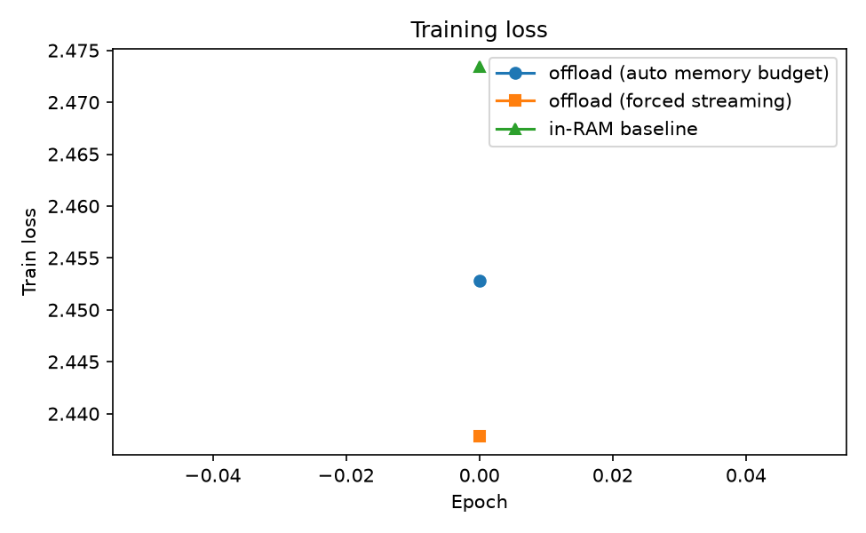
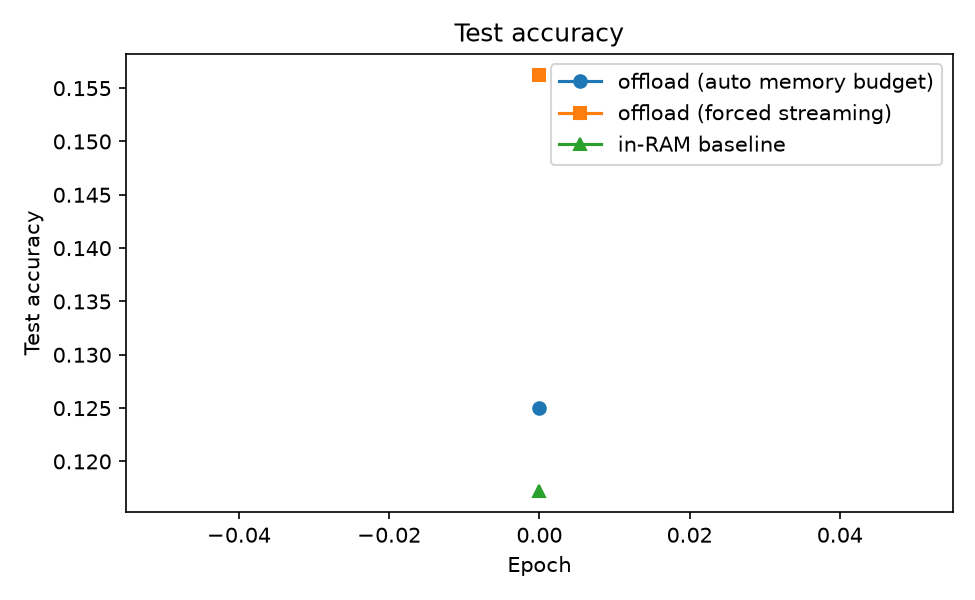
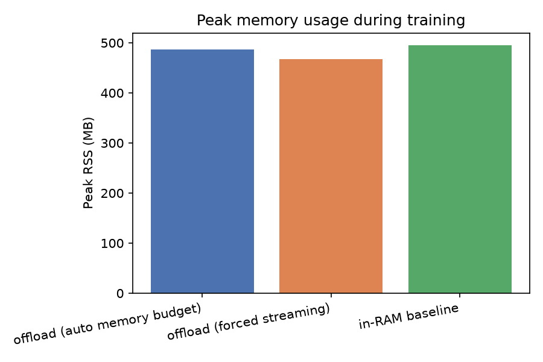
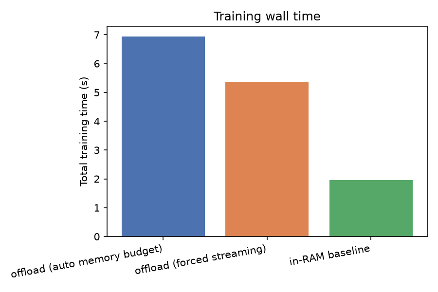
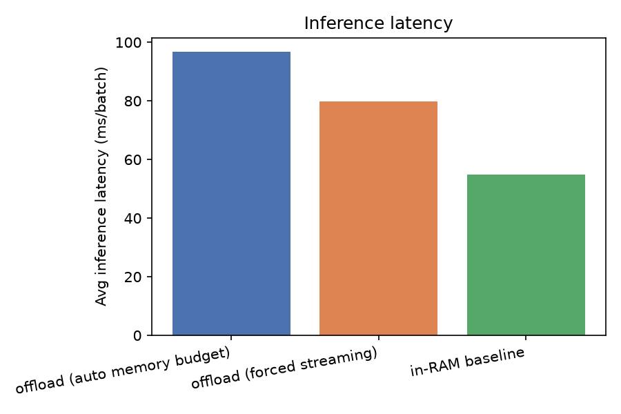
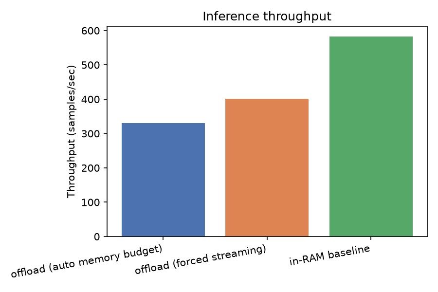

# Disk-Offloaded Deep Learning Trainer

Train deep neural networks whose total parameter size exceeds available RAM
by streaming each layer's weights from disk into RAM only for the brief
moment they're actually used, instead of holding the whole model resident.

The repo includes a plain in-RAM baseline ([normal_training/](normal_training))
and a benchmark suite ([benchmarks/](benchmarks)) that trains both variants
under identical conditions and compares training accuracy, training speed,
peak memory, and inference performance -- see [Benchmarks](#benchmarks) below.

## How it works

A normal `nn.Linear`/`nn.Conv2d` keeps its weight tensor alive in the
autograd graph from the moment `forward()` runs until the matching
`backward()` call consumes it. For an N-layer network that means, by the
time the last layer's forward pass finishes, **all N layers' weights are
resident in RAM simultaneously** -- exactly what you don't want when the
model is bigger than your RAM.

This project avoids that by never letting the autograd graph capture the
weight tensor at all:

- Every offloaded layer ([disk_offload/layers.py](disk_offload/layers.py):
  `OffloadedLinear`, `OffloadedConv2d`) stores only a string *key*, not a
  tensor. The real weight/bias data lives on disk
  ([disk_offload/storage.py](disk_offload/storage.py): `DiskTensorStore`).
- A custom `torch.autograd.Function`
  ([disk_offload/ops.py](disk_offload/ops.py)) loads the weight from disk
  right before `F.linear`/`F.conv2d` runs, and `del`s it immediately after
  computing the output -- it never touches the autograd tape.
- Gradients w.r.t. the weight are computed **manually** in the custom
  `backward()` (re-loading the weight from disk once more) and written
  straight to a "grad" file on disk, again without ever registering as a
  leaf tensor requiring grad.
- A disk-backed optimizer ([disk_offload/optim.py](disk_offload/optim.py):
  `DiskOffloadedSGD` / `DiskOffloadedAdam`) reads each parameter + its
  gradient + its optimizer state (momentum / Adam moments) from disk,
  computes the update on CPU, and writes the result back -- one layer at a
  time.
- A small **grad-anchor** trick (`nn.Parameter(torch.zeros(1))` per layer,
  fed into the `Function`) forces autograd to always build a graph node
  and call `backward()`, even for the very first layer of a network whose
  input (raw pixels) doesn't itself require grad. Without it that layer's
  gradient would silently never be computed.
- Because each layer's weight is only ever resident for its own
  forward/backward, **peak RAM usage becomes roughly O(1 layer) + O(activations)
  instead of O(N layers)**, so model size can scale with disk capacity.
- To hide disk latency, [disk_offload/layers.py](disk_offload/layers.py)'s
  `OffloadedSequential` prefetches the *next* layer's weights on a
  background thread ([disk_offload/storage.py](disk_offload/storage.py))
  while the *current* layer is still computing, overlapping I/O with CPU
  compute.
- BatchNorm/ReLU/Pool layers are left as ordinary resident `nn.Module`s --
  they're parameter-free or negligibly small, so there's no benefit to
  offloading them.

### Memory-aware layer batches

The memory-aware mode does not pin selected layers in RAM forever. Instead,
[`DiskTensorStore.configure_layer_batches`](disk_offload/storage.py) checks
currently available RAM and partitions complete layers into contiguous groups.
The `--memory-fraction` value, default `0.7`, defines the temporary working
set budget while leaving room for activations, the operating system, and
other processes.

During forward propagation, one group is loaded into RAM, all of its layers
run, and the group is released before the next group is loaded. During
backward propagation, the relevant group is loaded again, its layer gradients
are written to disk, and the group is released. The optimizer then updates
parameters and state on disk. No per-layer decisions are required.

For example, if the budget fits four layers, the movement is:

```text
disk: [L1 L2 L3 L4] [L5 L6 L7 L8] [L9 L10]
RAM:  [L1 L2 L3 L4] -> release -> [L5 L6 L7 L8] -> release -> [L9 L10]
```

Setting `--memory-fraction 0.0` creates one temporary batch per layer. A
single layer larger than the budget still gets its own batch because it must
remain computable. The cache remains a complete checkpoint because updated
parameters are written back to disk after every optimizer step.

```
disk_offload/
  storage.py      DiskTensorStore: raw binary tensor files + background prefetch + RAM-sized layer batches
  ops.py          Custom autograd Functions (Linear, Conv2d)
  layers.py       OffloadedLinear, OffloadedConv2d, OffloadedSequential
  optim.py        DiskOffloadedSGD, DiskOffloadedAdam
  memory_utils.py PeakMemoryTracker (RSS sampling)
models/
  cnn.py          Disk-offloaded VGG-style CNN (vgg11/13/16)
  baseline_cnn.py In-RAM reference CNN, structurally identical, for comparison
train.py          CLI: train on MNIST or CIFAR-10, offloaded or in-RAM
normal_training/  Standalone plain in-RAM trainer (no offloading at all)
benchmarks/
  compare.py      Runs both variants under identical conditions, produces plots + results.json
  over_ram.py     Builds and evaluates a model whose parameters exceed physical RAM
  results/        Generated plots + results.json (see Benchmarks section)
tests/
  test_correctness.py  Offloaded layers vs nn.Linear/nn.Conv2d: forward + grad match
  test_training.py     Full-model offloaded vs baseline: loss trajectories match, loss converges
```

## Setup

```powershell
pip install -r requirements.txt
```

## Usage

```powershell
# Disk-offloaded training (default) on MNIST
python train.py --dataset mnist --arch vgg11 --epochs 5

# Disk-offloaded training on CIFAR-10 with a deeper network
python train.py --dataset cifar10 --arch vgg16 --epochs 10

# In-RAM baseline for comparison (same architecture, no offloading)
python train.py --dataset mnist --no-offload --epochs 5

# Quick smoke test on a small subset
python train.py --dataset mnist --limit 256 --epochs 1 --fresh-cache

# Force (almost) everything to stream from disk, ignoring available RAM
python train.py --dataset mnist --memory-fraction 0.0
```

Each run prints per-epoch loss/accuracy plus total wall time and peak RSS
memory, so you can directly compare `--offload` vs `--no-offload`. It also
prints a `[memory budget]` line showing how many temporary layer batches were
created and the size of the largest batch, e.g.:

```
[memory budget] 5 temporary layer batches; largest batch 244.0 MB; 20 parameter tensors streamed
```

`--memory-fraction` (default `0.7`) controls how much of *currently
available* RAM the temporary layer-batch budget is allowed to use. Lower it
to leave more headroom for other processes, or set it to `0.0` to force one
layer per temporary batch.

Disk cache location defaults to `./offload_cache` (override with
`--cache-dir`); pass `--fresh-cache` to wipe it before a run.

## Validation

```powershell
python -m pytest tests -v
```

- `test_correctness.py` checks that `OffloadedLinear`/`OffloadedConv2d`
  produce bit-for-bit-equivalent (within float tolerance) forward outputs
  and gradients as `nn.Linear`/`nn.Conv2d` given identical weights.
- `test_training.py` builds a disk-offloaded VGG and a structurally
  identical in-RAM baseline from the same initial weights, trains both for
  several steps on identical batches, and checks their loss trajectories
  match closely and both converge -- validating the full forward+backward+
  optimizer pipeline, not just single layers. It also checks that promoting
  only *some* layers to RAM residency (mixed mode) still matches the
  baseline exactly.
- `test_memory_budget.py` checks that whole layers are grouped within the
  available RAM budget and that temporary groups are released after use.

## Test Hardware

The measurements in this README and in [REPORT.md](REPORT.md) were captured
on the following machine:

| Property | Measured value |
|---|---:|
| CPU | Intel Core i5-1135G7 |
| Physical cores | 4 |
| Logical processors | 8 |
| Physical RAM | 7.79 GB |
| Available RAM when measured | 0.30 GB to 0.42 GB |
| Free system-drive space | 81.30 GB |
| Python | 3.10.0 for the original benchmark capture |
| PyTorch | 2.14.0+cpu |

Available RAM changes while Windows and other programs are running, so the
important planning number is physical RAM plus the live availability check.
The trainer uses that live value rather than relying only on this table.

## Benchmarks

Generated by [benchmarks/compare.py](benchmarks/compare.py), which trains
three variants back-to-back on the *same* architecture and hyperparameters:
the disk-offloaded trainer with its default memory-aware layer-batch budget,
the disk-offloaded trainer forced to stream every layer from disk
(`--memory-fraction 0.0`, i.e. the old behavior / worst case), and the
[normal_training/](normal_training) in-RAM baseline. It then measures
training accuracy, wall time, peak RSS and inference performance for all
three. Reproduce with:

```powershell
python benchmarks/compare.py --dataset mnist --arch vgg11 --epochs 1 --limit 128 --batch-size 32
```

Setup: VGG11 (20 parameter tensors, ~36 MB total), MNIST (128-image
subset, resized to 32x32), batch size 32, Adam lr=1e-3, 1 epoch, CPU-only.
Raw numbers in [benchmarks/results/results.json](benchmarks/results/results.json).

| Metric                        | offload (auto memory budget) | offload (forced streaming) | in-RAM baseline |
|--------------------------------|---------------:|---------------:|----------------:|
| Final train loss               | 2.453           | 2.438           | 2.473           |
| Final test accuracy            | 12.5%           | 15.6%           | 11.7%           |
| Total training time (1 epoch)  | 6.9 s           | 5.4 s           | 2.0 s            |
| Peak RSS during training       | 486.4 MB        | 467.7 MB        | 495.1 MB         |
| Inference latency (ms/batch)   | 96.76 ms        | 79.75 ms        | 54.92 ms         |
| Inference throughput           | 331 samples/s   | 401 samples/s   | 583 samples/s    |

**Reading the results:**
- **The automatic run created one temporary 36.2 MB layer batch.** The
  complete VGG model was loaded as a group for forward and backward, then
  released. It did not permanently pin the tensors in RAM.
- **Forced streaming created ten temporary groups.** With
  `--memory-fraction 0.0`, each group contains one small layer, so the model
  demonstrates the same go-to-RAM and come-back-out behavior at the finest
  granularity.
- **This tiny one-epoch run is a plumbing benchmark, not an accuracy study.**
  The 128-image subset is too small for meaningful convergence, so the
  accuracy values should not be compared as model quality results.
- **Test accuracy differs across variants because each run uses an
  independent random weight initialization**, not because offloading
  changes the math -- this benchmark measures speed/memory/throughput, not
  numerical equivalence. Numerical equivalence (same initial weights, same
  batches, same loss trajectory) is separately and rigorously verified in
  [tests/test_correctness.py](tests/test_correctness.py) and
  [tests/test_training.py](tests/test_training.py), including a
  one-layer-batch case.
- **Peak RAM** remains bounded by the active group plus activations and
  process overhead. The real capacity demonstration is the separate
  [Over-RAM Capacity Test](#over-ram-capacity-test), where the total model
  exceeds physical RAM.
- **Inference** is run in-RAM for all three (weights already loaded once
  via the disk-backed layers by the time inference runs); latency is close
  between the two offloaded variants and both are somewhat slower than the
  baseline due to the extra layer-wrapper indirection.








## Over-RAM Capacity Test

The small VGG examples above fit in memory. To test the actual purpose of
disk streaming, [benchmarks/over_ram.py](benchmarks/over_ram.py) builds an
`OverRAMMLP` sized from the machine's physical RAM. On this laptop it used
36 hidden layers of width 8192, producing 39 disk-backed parameter tensors
and 9.03 GB of parameters. That is 1.16 times the machine's 7.79 GB of
physical RAM.

The test uses `--memory-fraction 0.0`, creates the full cache on disk, then
runs one real forward pass on an MNIST test image. It deliberately does not
claim to complete a useful training epoch at this size. A training epoch
would require many disk reads and writes and would not be a fair use of this
machine for a first capacity validation.

| Measurement | Result |
|---|---:|
| Model parameter size | 9.03 GB |
| Physical RAM | 7.79 GB |
| Parameter-to-RAM ratio | 1.16x |
| Temporary layer batches | 38 |
| Cache creation time | 101.0 s |
| Cache size | 9.03 GB |
| One-image forward time | 17.0 s |
| Peak RSS during forward | 0.857 GB |
| MNIST label | 7 |
| Predicted class | 0 |

The important result is capacity, not classification quality from one
untrained example. The complete model existed on disk and was evaluated
without keeping all 9.03 GB in RAM. Peak RSS stayed far below the model
size, while each individual layer was loaded only when needed.

The raw capture is in
[benchmarks/results/over_ram_results.json](benchmarks/results/over_ram_results.json).
Run it again with:

```powershell
python benchmarks/over_ram.py --cache-dir .\over_ram_cache_final
```


## Known limitations / next steps

- Only **parameters** are offloaded, not activations -- for very deep/wide
  networks with large batch sizes, activation memory (needed for backward)
  can still dominate. Adding `torch.utils.checkpoint`-style activation
  recomputation would extend the same idea to activations.
- Each offloaded layer's weight is read from disk **twice** per training
  step (forward + backward); prefetching hides most of this but a fast
  disk (SSD/NVMe) matters a lot for throughput.
- Currently CPU-only, matching the "use whole RAM + CPU compute" goal;
  extending `DiskTensorStore` to stream disk → pinned host memory → GPU
  would let the same technique offload GPU-VRAM-bound models too.

## Author

Anas Oujja

## License

[MIT](LICENSE)
