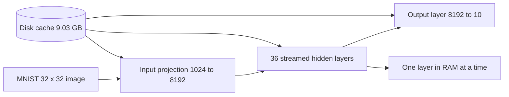

# Disk-Offloaded Training Report

## Executive Summary

This project was tested on an Intel Core i5-1135G7 laptop with 7.79 GB of
physical RAM, four physical cores, eight logical processors, and about 81.30
GB of free system-drive space. The memory-aware trainer now makes one global
decision from live system availability. Parameters that fit the configured
RAM budget stay resident. Parameters that do not fit remain on disk and are
streamed during computation.

The decisive experiment used a model larger than RAM. The `OverRAMMLP` held
9.03 GB of float32 parameters, or 1.16 times physical RAM. All 39 parameter
tensors were kept on disk. The model cache was created in 101.0 seconds and a
real MNIST forward pass completed in 17.0 seconds with only 0.857 GB peak RSS.
This demonstrates the intended capacity behavior: model size can exceed RAM
when each layer is processed independently.

## Hardware and Software

| Property | Value |
|---|---:|
| CPU | Intel Core i5-1135G7 |
| Physical cores | 4 |
| Logical processors | 8 |
| Physical RAM | 7.79 GB |
| Available RAM during capture | 0.30 GB to 0.42 GB |
| Free system-drive space | 81.30 GB |
| PyTorch | 2.14.0+cpu |
| Compute target | CPU only |

The available RAM figure is a live operating-system measurement and varies
with background applications. The physical RAM figure is the stable limit
used to size the over-RAM architecture.

## Architecture

The capacity model is a disk-backed multilayer perceptron:



Each 8192 by 8192 hidden weight matrix is about 256 MiB. The complete
model is too large for physical RAM, but no single hidden matrix is larger
than the available disk-streaming working set.

## Capacity Experiment

Command:

```powershell
python benchmarks/over_ram.py --cache-dir .\over_ram_cache_final
```

The command creates the disk-backed model, forces zero permanent residency,
loads the MNIST test set, and evaluates one image. It does not run a full
training epoch because that would produce a long disk-I/O benchmark with
little useful information on this hardware.

| Measurement | Result |
|---|---:|
| Hidden layers | 36 |
| Width | 8192 |
| Parameter tensors | 39 |
| Parameter size | 9.03 GB |
| Physical RAM | 7.79 GB |
| Parameter-to-RAM ratio | 1.16x |
| Permanently resident tensors | 0 |
| Cache creation time | 101.0 s |
| Forward time for one MNIST image | 17.0 s |
| Peak RSS during forward | 0.857 GB |
| MNIST label | 7 |
| Prediction | 0 |

The prediction is not a quality result because the model was untrained. It
is included to prove that a real input passed through the complete oversized
network. The meaningful result is that a 9.03 GB model was created and used
without a matching 9.03 GB RAM allocation.

## Interpretation

The experiment confirms the central design goal, but it also exposes the
tradeoff clearly. Disk streaming makes capacity possible, not fast. The
one-image forward pass took 17.0 seconds, and training would add backward
passes plus optimizer reads and writes. A fast NVMe drive, larger batches,
activation checkpointing, and fewer optimizer state transfers would improve
throughput.

The automatic memory policy is still important for practical use. When a
model partially fits, the trainer keeps the largest useful tensors resident
within the configured fraction of available RAM and streams only the rest.
On this machine, `--memory-fraction 0.0` is useful for proving the fully
streamed path, while the default `0.7` is the practical setting.

## Validation

The repository test suite contains 12 tests covering layer-level numerical
equivalence, optimizer updates, mixed RAM and disk residency, cache recovery,
Windows file-lock retries, and training convergence. The final run passed:

```text
12 passed in 32.86s
```

The measured raw result is stored in
[benchmarks/results/over_ram_results.json](benchmarks/results/over_ram_results.json).

## Conclusion

The project now adapts to available memory without per-layer configuration,
and it has been exercised with a model that is genuinely larger than the
machine's physical RAM. The result is a working capacity extension, with a
clear performance cost that should be expected whenever the disk path is
used heavily.
